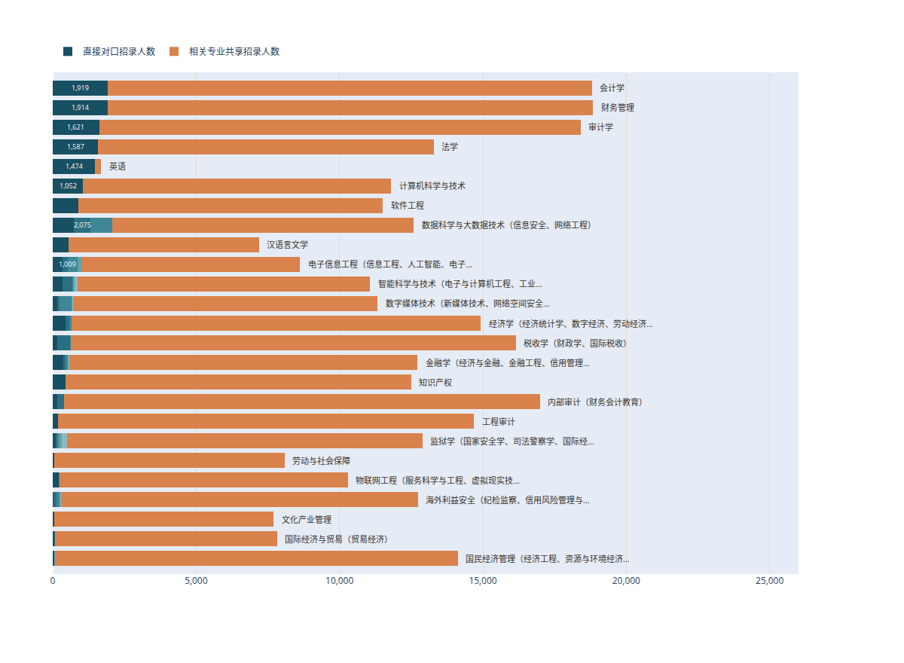

# OpenXueFeng


面向升学、专业选择、职业发展规划与志愿分析的开放资源仓库。

Pages: https://dorajaymon.github.io/openXueFeng/

## 本科专业分析

### 考公专业榜：专业选对，编制上岸

基于 2026 年国考 + 云南、山东、湖北、江苏省考职位表，对 840 个本科专业和 93 个专业类拆解公务员招录机会。

- 项目页：https://dorajaymon.github.io/openXueFeng/本科专业分析/公考对口分析/
- 数据目录：`本科专业分析/公考对口分析/data/`
- 公开说明：`本科专业分析/公考对口分析/docs/guide.md`

## 关键结论

- 专业榜前列由 **财务管理、会计学、审计学** 把持，法学和计算机相关专业也很强。
- 专业类层面，**财政学类、经济学类、法学类、计算机类** 是主要机会池。
- **工商管理类** 总机会大，但类内机会高度集中，不能只看专业类总量。
- 招录人数不是报名人数、竞争比或上岸概率，只能说明职位表中的机会结构。

## 专业榜 Top 5

| 排名 | 专业 | 总分 | 机会规模 | 直接对口 | 独占指数 |
|---:|---|---:|---:|---:|---:|
| 1 | 财务管理 | 100.0 | 100.0 | 99.9 | 100.0 |
| 2 | 会计学 | 99.9 | 99.9 | 100.0 | 99.9 |
| 3 | 审计学 | 99.8 | 99.8 | 99.8 | 99.8 |
| 4 | 财政学 | 99.0 | 99.4 | 98.6 | 99.0 |
| 5 | 法学 | 98.9 | 97.9 | 99.6 | 99.5 |

## 专业类榜 Top 5

| 排名 | 专业类 | 总分 | 机会规模 | 直接需求 | 独占指数 | 类内均衡 |
|---:|---|---:|---:|---:|---:|---:|
| 1 | 财政学类 | 94.6 | 98.9 | 100.0 | 95.7 | 60.9 |
| 2 | 经济学类 | 91.8 | 96.7 | 98.9 | 96.7 | 41.3 |
| 3 | 法学类 | 91.4 | 94.6 | 97.8 | 100.0 | 39.1 |
| 4 | 计算机类 | 89.5 | 95.7 | 95.7 | 98.9 | 26.1 |
| 5 | 工商管理类 | 87.9 | 100.0 | 94.6 | 97.8 | 1.1 |

## 关键图解

### 专业类机会结构


浅色条是专业类的可报机会上限，深色条是职位直接面向该专业类的招录人数。财政学类、经济学类、法学类、计算机类不仅总量靠前，直接面向本类的需求也更扎实；工商管理类总量很大，但更多依赖类内少数专业。

### 专业机会拆分



蓝色是直接对口机会，橙色是相关专业共享机会。会计学、财务管理、审计学、法学、英语等专业的直接对口更明显；计算机、电子信息等方向则同时受益于专业类共享机会。

## 公开数据

```text
本科专业分析/公考对口分析/data/
├── 01_全部考试_专业招录指标.csv
├── 02_全部考试_专业类招录指标.csv
├── 03_省考_专业招录指标.csv
├── 04_省考_专业类招录指标.csv
├── 05_全部考试_专业leaderboard.csv
├── 06_全部考试_专业类leaderboard.csv
└── 排行榜数据_专业与专业类.zip
```

## 目录结构

```text
.
├── index.html
├── README.md
├── assets/
└── 本科专业分析/
    └── 公考对口分析/
        ├── index.html
        ├── data/
        └── docs/
```

## Coming soon

更多省份、交互查询、历年对比，以及职业发展规划和志愿分析资源。
