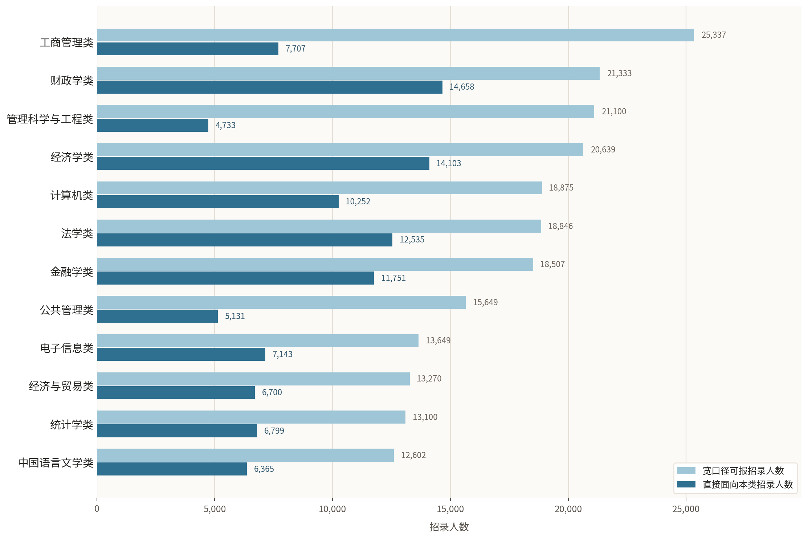
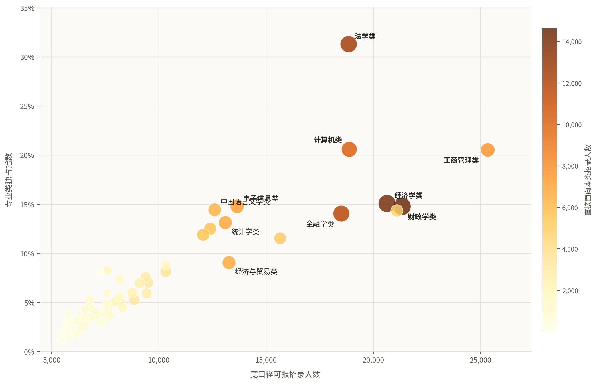

<div align="center">
  <p>
    
    
  </p>

  <p><strong>面向升学、职业规划与专业选择的开放数据分析项目。</strong></p>

  <p>
  <strong><a href="https://dorajaymon.github.io/openXueFeng/">在线阅读 GitHub Pages</a></strong>
  ·
  <a href="本科专业分析/公考对口分析/data/排行榜数据_专业与专业类.zip">下载数据</a>
  </p>
</div>

#### 项目定位

OpenXueFeng 关注学生在升学和**职业生涯规划**中会遇到的长期选择问题：专业怎么选，院校怎么比较，导师和研究方向怎么判断，行业机会如何变化。项目希望持续积累有**数据依据**、**统计口径清楚**、**可下载复核**的定量分析结果，为学生、家长和研究者提供更可靠的参考材料。

**为什么不直接问 AI？** AI 很擅长解释和总结已有信息，但它通常只能基于网页文本和容易获取的混杂数据作答。要让 AI 有依据地支持专业选择、院校比较、导师和研究方向判断，好的**数据资源**和**初步统计分析**是必要的。OpenXueFeng 要做的是把这些基础材料整理出来，让人和 AI 都能在更扎实的事实基础上讨论选择。

## 专题一：考公专业榜

聚焦本科专业与公务员招录机会之间的关系，帮助读者比较不同专业在公开职位表中的机会结构。

| 入口 | 说明 |
|---|---|
| [在线查看](https://dorajaymon.github.io/openXueFeng/) | 面向普通读者的网页入口，打开后直接进入考公专业榜 |
| [数据说明](本科专业分析/公考对口分析/docs/guide.md) | 字段定义、统计口径、映射规则与注意事项 |
| [下载排行榜](本科专业分析/公考对口分析/data/排行榜数据_专业与专业类.zip) | 专业榜与专业类榜完整 CSV |
| [数据目录](本科专业分析/公考对口分析/data/) | 聚合后的公开数据表 |

### 专题产出

本专题基于 2026 年国考 + 云南、山东、湖北、江苏省考职位表，整理 **840 个本科专业** 和 **93 个专业类** 的招录机会指标。它不直接预测上岸概率，而是把职位表中的专业相关信息转化为可比较、可下载、可复核的数据资源。

- **综合榜单**：围绕机会规模、直接对口、机会独占性等维度，对专业和专业类进行排序，给出快速比较的入口。
- **结构化数据**：清理并汇总 840 个本科专业和 93 个专业类的招录机会指标，提供 CSV 与说明文档，方便复核和二次分析。
- **可视化分析**：用图表展示专业类机会结构、专业机会来源和独占程度，帮助读者判断一个专业在全局中的位置。
- **AI 友好材料**：公开字段说明和数据表，让 AI 工具能基于明确口径做进一步比较，而不是只依赖零散网页信息。

### 关键结论

- 专业榜前列由 **财务管理、会计学、审计学** 把持，法学和计算机相关专业也很强。
- 专业类层面，**财政学类、经济学类、法学类、计算机类** 是主要机会池。
- **工商管理类** 总机会大，但类内机会高度集中，不能只看专业类总量。
- 一些讨论度不高的专业在直接对口或独占性上表现突出，适合结合完整 CSV 继续筛选。

### 专业榜 Top 10

<table>
  <thead>
    <tr>
      <th align="right" bgcolor="#f6f1e8">排名</th>
      <th align="left" bgcolor="#f6f1e8">专业</th>
      <th align="right" bgcolor="#f6f1e8">总分</th>
      <th align="right" bgcolor="#f6f1e8">机会规模</th>
      <th align="right" bgcolor="#f6f1e8">直接对口</th>
      <th align="right" bgcolor="#f6f1e8">独占指数</th>
    </tr>
  </thead>
  <tbody>
    <tr><td align="right">1</td><td align="left"><strong>财务管理</strong></td><td align="right" bgcolor="#fff7e6"><strong>100.0</strong></td><td align="right">100.0</td><td align="right">99.9</td><td align="right">100.0</td></tr>
    <tr><td align="right">2</td><td align="left"><strong>会计学</strong></td><td align="right" bgcolor="#fff7e6"><strong>99.9</strong></td><td align="right">99.9</td><td align="right">100.0</td><td align="right">99.9</td></tr>
    <tr><td align="right">3</td><td align="left"><strong>审计学</strong></td><td align="right" bgcolor="#fff7e6"><strong>99.8</strong></td><td align="right">99.8</td><td align="right">99.8</td><td align="right">99.8</td></tr>
    <tr><td align="right">4</td><td align="left">财政学</td><td align="right" bgcolor="#fffaf0"><strong>99.0</strong></td><td align="right">99.4</td><td align="right">98.6</td><td align="right">99.0</td></tr>
    <tr><td align="right">5</td><td align="left">法学</td><td align="right" bgcolor="#fffaf0"><strong>98.9</strong></td><td align="right">97.9</td><td align="right">99.6</td><td align="right">99.5</td></tr>
    <tr><td align="right">6</td><td align="left">财务会计教育</td><td align="right" bgcolor="#fffaf0"><strong>98.4</strong></td><td align="right">99.6</td><td align="right">96.3</td><td align="right">99.4</td></tr>
    <tr><td align="right">7</td><td align="left">经济学</td><td align="right" bgcolor="#fffaf0"><strong>98.2</strong></td><td align="right">99.0</td><td align="right">98.1</td><td align="right">97.1</td></tr>
    <tr><td align="right">8</td><td align="left">知识产权</td><td align="right" bgcolor="#fffaf0"><strong>97.9</strong></td><td align="right">97.1</td><td align="right">98.6</td><td align="right">98.1</td></tr>
    <tr><td align="right">9</td><td align="left">工程审计</td><td align="right" bgcolor="#fffaf0"><strong>97.7</strong></td><td align="right">98.9</td><td align="right">95.1</td><td align="right">99.2</td></tr>
    <tr><td align="right">10</td><td align="left">金融学</td><td align="right" bgcolor="#fffaf0"><strong>97.3</strong></td><td align="right">97.7</td><td align="right">97.9</td><td align="right">95.8</td></tr>
  </tbody>
</table>

### 专业类榜 Top 10

<table>
  <thead>
    <tr>
      <th align="right" bgcolor="#f6f1e8">排名</th>
      <th align="left" bgcolor="#f6f1e8">专业类</th>
      <th align="right" bgcolor="#f6f1e8">总分</th>
      <th align="right" bgcolor="#f6f1e8">机会规模</th>
      <th align="right" bgcolor="#f6f1e8">直接需求</th>
      <th align="right" bgcolor="#f6f1e8">独占指数</th>
      <th align="right" bgcolor="#f6f1e8">类内均衡</th>
    </tr>
  </thead>
  <tbody>
    <tr><td align="right">1</td><td align="left"><strong>财政学类</strong></td><td align="right" bgcolor="#fff7e6"><strong>94.6</strong></td><td align="right">98.9</td><td align="right">100.0</td><td align="right">95.7</td><td align="right">60.9</td></tr>
    <tr><td align="right">2</td><td align="left"><strong>经济学类</strong></td><td align="right" bgcolor="#fff7e6"><strong>91.8</strong></td><td align="right">96.7</td><td align="right">98.9</td><td align="right">96.7</td><td align="right">41.3</td></tr>
    <tr><td align="right">3</td><td align="left"><strong>法学类</strong></td><td align="right" bgcolor="#fff7e6"><strong>91.4</strong></td><td align="right">94.6</td><td align="right">97.8</td><td align="right">100.0</td><td align="right">39.1</td></tr>
    <tr><td align="right">4</td><td align="left">计算机类</td><td align="right" bgcolor="#fffaf0"><strong>89.5</strong></td><td align="right">95.7</td><td align="right">95.7</td><td align="right">98.9</td><td align="right">26.1</td></tr>
    <tr><td align="right">5</td><td align="left">工商管理类</td><td align="right" bgcolor="#fffaf0"><strong>87.9</strong></td><td align="right">100.0</td><td align="right">94.6</td><td align="right">97.8</td><td align="right">1.1</td></tr>
    <tr><td align="right">6</td><td align="left">金融学类</td><td align="right" bgcolor="#fffaf0"><strong>87.5</strong></td><td align="right">93.5</td><td align="right">96.7</td><td align="right">91.3</td><td align="right">29.3</td></tr>
    <tr><td align="right">7</td><td align="left">电子信息类</td><td align="right" bgcolor="#fffaf0"><strong>86.7</strong></td><td align="right">91.3</td><td align="right">93.5</td><td align="right">94.6</td><td align="right">30.4</td></tr>
    <tr><td align="right">8</td><td align="left">统计学类</td><td align="right" bgcolor="#fffaf0"><strong>86.5</strong></td><td align="right">89.1</td><td align="right">92.4</td><td align="right">90.2</td><td align="right">50.0</td></tr>
    <tr><td align="right">9</td><td align="left">中国语言文学类</td><td align="right" bgcolor="#fffaf0"><strong>84.5</strong></td><td align="right">88.0</td><td align="right">90.2</td><td align="right">93.5</td><td align="right">32.6</td></tr>
    <tr><td align="right">10</td><td align="left">经济与贸易类</td><td align="right" bgcolor="#fffaf0"><strong>84.5</strong></td><td align="right">90.2</td><td align="right">91.3</td><td align="right">85.9</td><td align="right">40.2</td></tr>
  </tbody>
</table>

### 关键图解

#### 哪些专业类机会最多，也更对口？



浅色条是专业类的可报机会上限，深色条是职位直接面向该专业类的招录人数。财政学类、经济学类、法学类、计算机类不仅总量靠前，直接面向本类的需求也更扎实；工商管理类总量很大，但更多依赖类内少数专业。

#### 哪些专业类机会更“独占”？



横轴是宽口径可报招录人数，纵轴是专业类独占指数。越靠右，机会规模越大；越靠上，相关岗位越少同时开放给其他专业类。法学类、财政学类在规模和独占性上都更突出；工商管理类规模很大，但独占性相对偏低。

### 公开数据

```text
本科专业分析/公考对口分析/data/
├── 01_全部考试_专业招录指标.csv
├── 02_全部考试_专业类招录指标.csv
├── 03_省考_专业招录指标.csv
├── 04_省考_专业类招录指标.csv
├── 05_全部考试_专业leaderboard.csv
├── 06_全部考试_专业类leaderboard.csv
└── 排行榜数据_专业与专业类.zip
```

## 许可协议

本仓库公开的数据表、图表、文档和分析结果采用 [CC BY 4.0](LICENSE) 许可协议发布。转载、引用或二次使用时，请注明来源为 OpenXueFeng，并保留指向本仓库或在线页面的链接。
